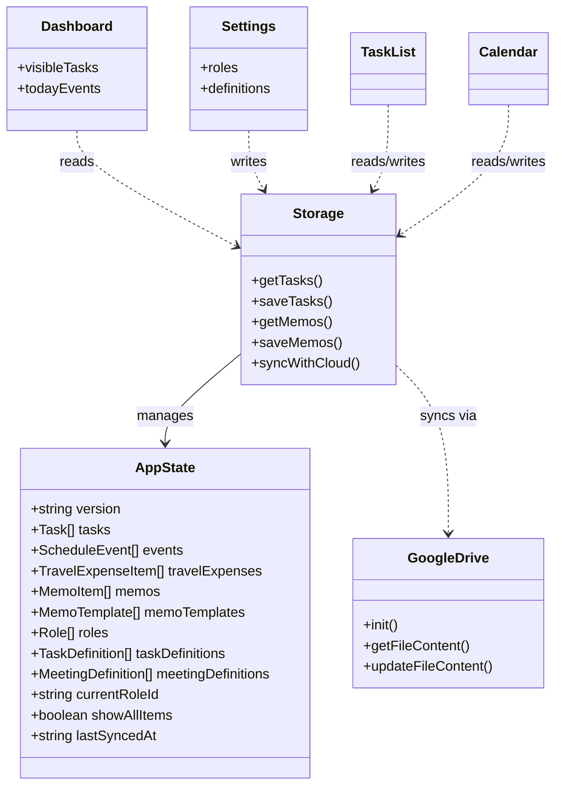
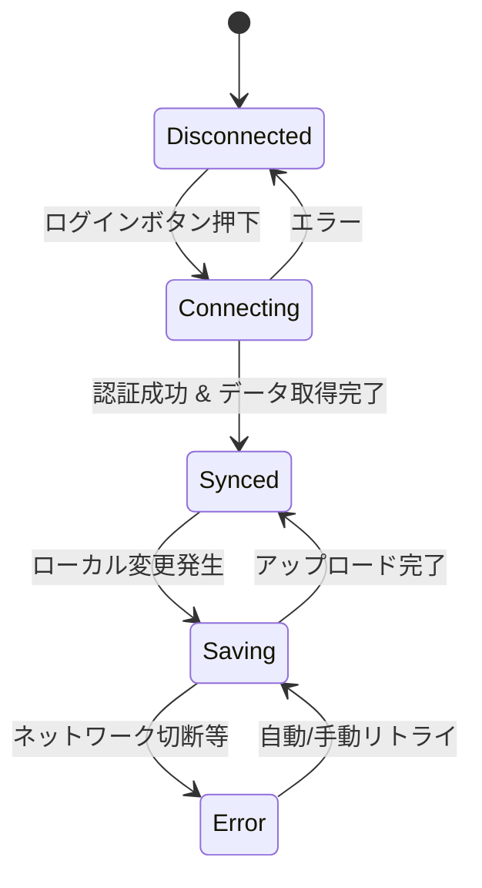

# 設計 (DESIGN.md)

## システム概要

本アプリは、ユーザーのデバイスローカル（`localStorage`）およびクラウド（Google Drive）の両方にデータを保持するハイブリッドなデータ管理モデルを採用しています。

## 構成要素

### 1. プレゼンテーション層 (UI)
- **Layout / Header / BottomNav**: 画面の骨格とモバイル対応ナビゲーション。
- **Dashboard / TaskList / Calendar**: 各機能のメイン画面。
- **MemoEditor**: 高機能リッチテキスト（HTML）と音声に対応した統合エディタ。
- **SyncStatus**: Google連携の認証・同期状態を管理するUI。

### 2. ビジネスロジック / ユーティリティ層
- **storage.ts**: データの読み書きと同期のオーケストレーション。
- **googleDrive.ts**: Google APIとの低レベル通信。
- **migrations.ts**: データ構造変更時の安全な移行処理。

### 3. データ層
- **localStorage**: ネットワークオフライン時や高速な読み込みのための一次保存先。
- **Google Drive (appDataFolder)**: 複数デバイス間での同期、およびバックアップのための保存先。

## 静的修造 (クラス / コンポーネント図)

主要なステート管理とコンポーネントの依存関係を以下に示します。

## データ構造 (AppState)

全てのデータは一つのJSONオブジェクトとして管理されます。

- `version`: データ構造のバージョン（現在: 9）。
- `tasks`: タスクの配列（役職に応じたフィルタリング、サブタスク対応、回答率記録フラグ `trackResponseRate` 追加）。
- `events`: スケジュールの配列（会議体からのインポート対応。`status` による進捗管理。メモは外部参照）。
- `travelExpenses`: 独立した旅費精算データの配列。
- `memos`: グローバルに集約されたメモデータの配列（HTML 形式または音声 ID を保持）。
- `memoTemplates`: メモ作成時に利用する定型文テンプレートの配列。
- `roles`: 役職定義の配列。
- `TaskCategory`: `'union_member'` (組合員), `'administrative'` (事務), `'committee'` (委員)
- `taskDefinitions`: 定型タスク（テンプレート）の定義配列（`trackResponseRate` 追加）。
- `meetingDefinitions`: 会議体（定例会議）の定義配列。
- `currentRoleId`: ユーザー自身の現在の役職ID。
- `showAllItems`: 全表示モードのフラグ。
- `lastSyncedAt`: 最終同期日時。

## 動的構造

### クラウド同期フロー
ユーザーがブラウザを起動してからデータが同期されるまでの流れです。

```mermaid
sequenceDiagram
    participant U as User
    participant B as Browser (Local)
    participant G as Google Drive (Cloud)
    
    U->>B: ページ読み込み (リフレッシュ)
    B->>B: storage.init() / localStorageから旧データ読込
    B->>B: googleDrive.init() (sessionStorage からトークン復元)
    alt トークンあり (sessionStorage)
        B->>B: SyncStatus: 自動同期開始
        B->>G: storage.syncWithCloud() 最新ファイル取得
    else トークンなし & 同期有効フラグあり (localStorage)
        B->>G: auth.init() サイレントサインイン試行
        alt 認証成功
            B->>G: storage.syncWithCloud() 最新ファイル取得
        else 認証失敗/初ログイン
            B-->>U: ログインボタン表示
        end
    end
    G-->>B: union_app_data.json
    B->>B: migrations.migrateData() 必要なら移行
    B->>B: UI状態更新

    Note over User, Browser (Local): 自動同期トリガー (v9)
    rect rgb(30, 40, 60)
        User->>Browser (Local): ウィンドウフォーカス / 3分経過
        Browser (Local)->>G: getFileMetadata(fileId)
        Browser (Local)->>Browser (Local): 前回同期時刻と比較
        alt クラウドが新しい
            Browser (Local)->>G: storage.syncWithCloud()
            Browser (Local)->>Browser (Local): ページリロードで反映
        end
    end
    
    U->>B: データの変更 (タスク完了、予定進捗更新等)
    B->>B: save to localStorage
    B->>G: updateFileContent (Background)
```

### 同期状態の遷移
アプリ内の同期ステータスの管理フローです。

## クラウド同期フロー (詳細)

設計の詳細やエラーハンドリングの検討事項については、 [DESIGN_DETAILS.md](./DESIGN_DETAILS.md) を参照してください。
