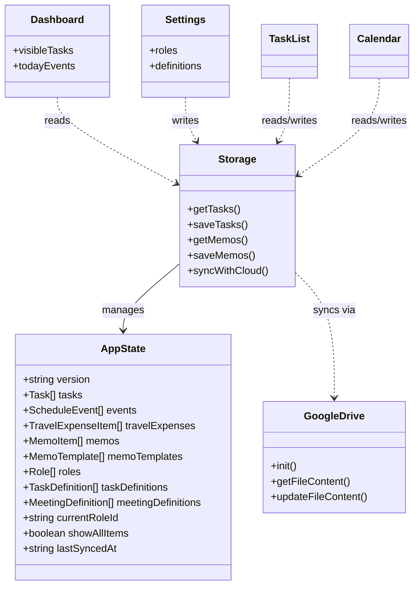
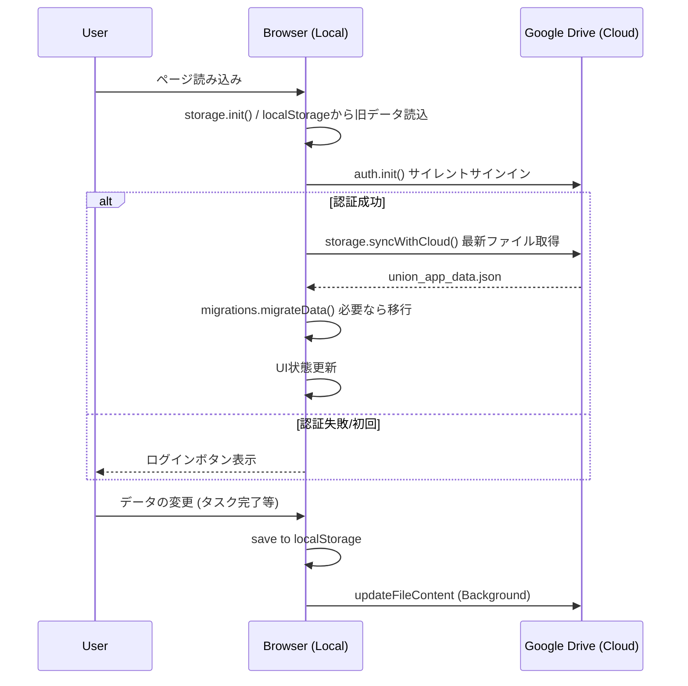
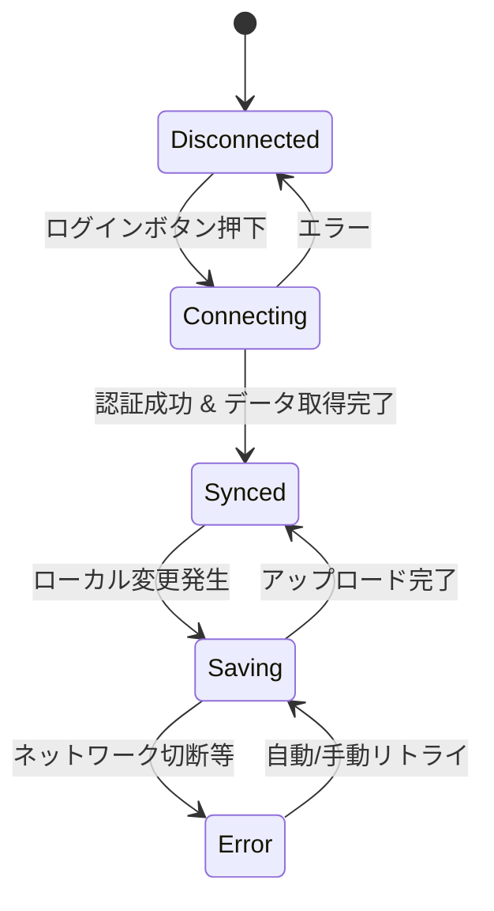

# 設計 (DESIGN.md)

## システム概要

本アプリは、ユーザーのデバイスローカル（`localStorage`）およびクラウド（Google Drive）の両方にデータを保持するハイブリッドなデータ管理モデルを採用しています。

## 構成要素

### 1. プレゼンテーション層 (UI)
- **Layout / Header / BottomNav**: 画面の骨格とモバイル対応ナビゲーション。
- **Dashboard / TaskList / Calendar**: 各機能のメイン画面。
- **SyncStatus**: Google連携の認証・同期状態を管理するUI。

### 2. ビジネスロジック / ユーティリティ層
- **storage.ts**: データの読み書きと同期のオーケストレーション。
- **googleDrive.ts**: Google APIとの低レベル通信。
- **migrations.ts**: データ構造変更時の安全な移行処理。

### 3. データ層
- **localStorage**: ネットワークオフライン時や高速な読み込みのための一次保存先。
- **Google Drive (appDataFolder)**: 複数デバイス間での同期、およびバックアップのための保存先。

## 静的修造 (クラス / コンポーネント図)

主要なステート管理とコンポーネントの依存関係を以下に示します。

## データ構造 (AppState)

全てのデータは一つのJSONオブジェクトとして管理されます。

- `version`: データ構造のバージョン（現在: 6）。
- `tasks`: タスクの配列（役職に応じたフィルタリング、サブタスク対応。メモは外部参照）。
- `events`: スケジュールの配列（会議体からのインポート対応。メモは外部参照）。
- `travelExpenses`: 独立した旅費精算データの配列。
- `memos`: グローバルに集約されたメモデータの配列（IDによる紐付け）。
- `memoTemplates`: メモ作成時に利用する定型文テンプレートの配列。
- `roles`: 役職定義の配列。
- `taskDefinitions`: 定型タスク（テンプレート）の定義配列。
- `meetingDefinitions`: 会議体（定例会議）の定義配列。
- `currentRoleId`: ユーザー自身の現在の役職ID。
- `showAllItems`: 全表示モードのフラグ。
- `lastSyncedAt`: 最終同期日時。

## 動的構造

### クラウド同期フロー
ユーザーがブラウザを起動してからデータが同期されるまでの流れです。

### 同期状態の遷移
アプリ内の同期ステータスの管理フローです。

## クラウド同期フロー (詳細)

設計の詳細やエラーハンドリングの検討事項については、 [DESIGN_DETAILS.md](./DESIGN_DETAILS.md) を参照してください。
